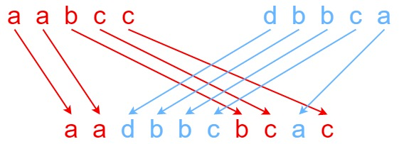

# My experience
## Feb 24th 2021
Solved on first try optimally in less than estimating 30 minutes.
It is a good example of how dynamic programming works.
See spoilers.md for some tips on how to approach this kind of problem in the future.
It's not a bad problem to do again for practice of dynamic programming.

# Current description
Given strings s1, s2, and s3, find whether s3 is formed by an interleaving of s1 and s2.

An interleaving of two strings s and t is a configuration where they are divided into non-empty substrings such that:

s = s1 + s2 + ... + sn
t = t1 + t2 + ... + tm
|n - m| <= 1
The interleaving is s1 + t1 + s2 + t2 + s3 + t3 + ... or t1 + s1 + t2 + s2 + t3 + s3 + ...
Note: a + b is the concatenation of strings a and b.

Example 1:

Input: s1 = "aabcc", s2 = "dbbca", s3 = "aadbbcbcac"
Output: true
Example 2:

Input: s1 = "aabcc", s2 = "dbbca", s3 = "aadbbbaccc"
Output: false
Example 3:

Input: s1 = "", s2 = "", s3 = ""
Output: true

Constraints:

0 <= s1.length, s2.length <= 100
0 <= s3.length <= 200
s1, s2, and s3 consist of lower-case English letters.