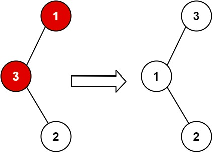
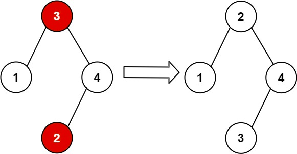

[Link](https://leetcode.com/problems/recover-binary-search-tree/)

Good to review? I'm not sure. I sunk 80 minutes into it on Feb 24th 2021 and am still don't understand it well. Will
more time help or just be a waste? I would go to other problems first and come back later.

My advice for future me:
O(n) solution is hard enough to find. I think focus on that one first. O(1) solution might take some reading of other
people's stuff first.
For this one, be prepared to look at other people's answers to understand. I don't really understand this problem 
right now.

Here's the official description:

You are given the root of a binary search tree (BST), where exactly two nodes of the tree were swapped by mistake. Recover the tree without changing its structure.

Follow up: A solution using O(n) space is pretty straight forward. Could you devise a constant space solution?

Example 1:

Input: root = [1,3,null,null,2]
Output: [3,1,null,null,2]
Explanation: 3 cannot be a left child of 1 because 3 > 1. Swapping 1 and 3 makes the BST valid.
Example 2:

Input: root = [3,1,4,null,null,2]
Output: [2,1,4,null,null,3]
Explanation: 2 cannot be in the right subtree of 3 because 2 < 3. Swapping 2 and 3 makes the BST valid.

Constraints:

The number of nodes in the tree is in the range [2, 1000].
-231 <= Node.val <= 231 - 1